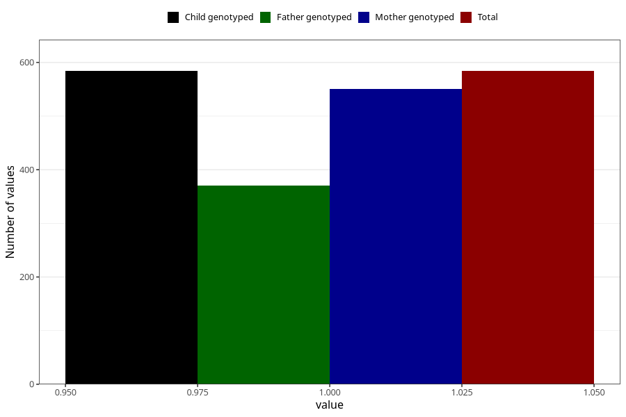

# formula_colett_1m
Variable mapping to `DD57` in `Skjema4_6mnd_v12`.
- Number of values:

| Value | Total | Child genotyped | Mother genotyped | Father genotyped |
| ----- | ----- | --------------- | ---------------- | ---------------- |
| Missing | 80439 | 80439 | 75679 | 52941 |
| Non-missing | 584 | 584 | 550 | 370 |
| 1 | 584 | 584 | 550 | 370 |

