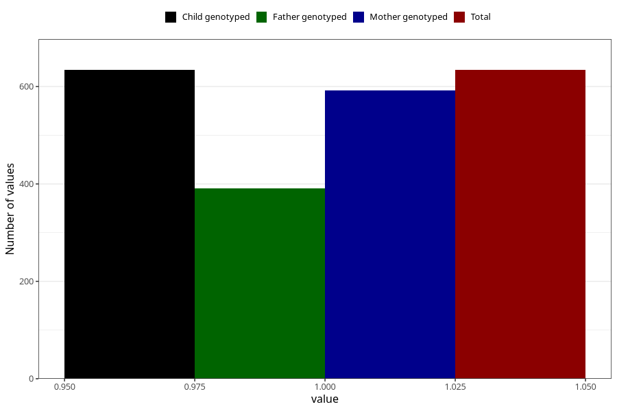

# formula_colett_2m
Variable mapping to `DD58` in `Skjema4_6mnd_v12`.
- Number of values:

| Value | Total | Child genotyped | Mother genotyped | Father genotyped |
| ----- | ----- | --------------- | ---------------- | ---------------- |
| Missing | 80389 | 80389 | 75637 | 52920 |
| Non-missing | 634 | 634 | 592 | 391 |
| 1 | 634 | 634 | 592 | 391 |

