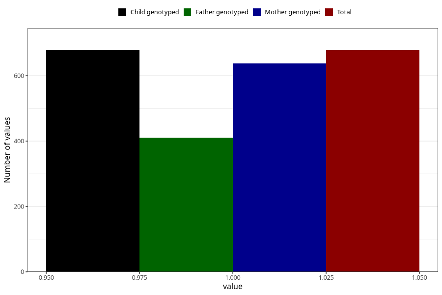

# formula_colett_3m
Variable mapping to `DD59` in `Skjema4_6mnd_v12`.
- Number of values:

| Value | Total | Child genotyped | Mother genotyped | Father genotyped |
| ----- | ----- | --------------- | ---------------- | ---------------- |
| Missing | 80345 | 80345 | 75591 | 52901 |
| Non-missing | 678 | 678 | 638 | 410 |
| 1 | 678 | 678 | 638 | 410 |

