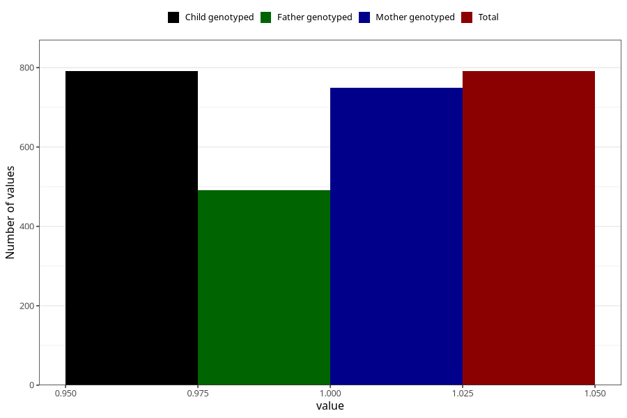

# formula_colett_4m
Variable mapping to `DD60` in `Skjema4_6mnd_v12`.
- Number of values:

| Value | Total | Child genotyped | Mother genotyped | Father genotyped |
| ----- | ----- | --------------- | ---------------- | ---------------- |
| Missing | 80232 | 80232 | 75479 | 52820 |
| Non-missing | 791 | 791 | 750 | 491 |
| 1 | 791 | 791 | 750 | 491 |

