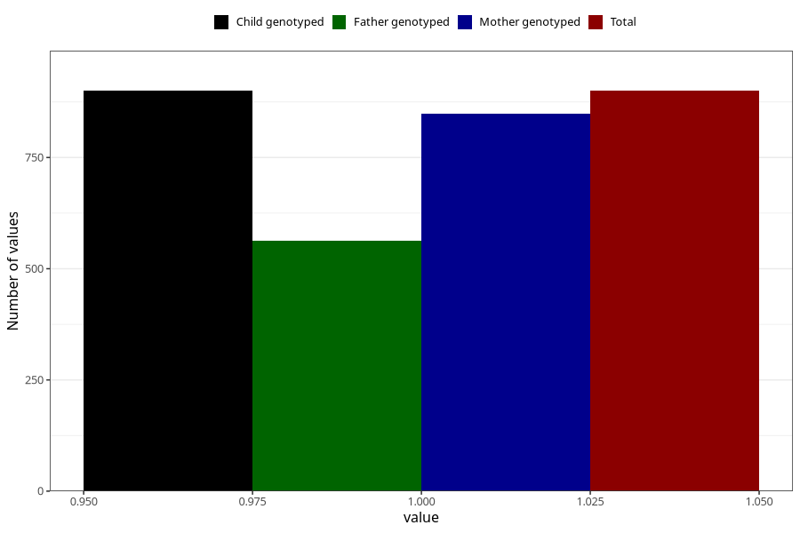

# formula_colett_5m
Variable mapping to `DD61` in `Skjema4_6mnd_v12`.
- Number of values:

| Value | Total | Child genotyped | Mother genotyped | Father genotyped |
| ----- | ----- | --------------- | ---------------- | ---------------- |
| Missing | 80123 | 80123 | 75381 | 52748 |
| Non-missing | 900 | 900 | 848 | 563 |
| 1 | 900 | 900 | 848 | 563 |

