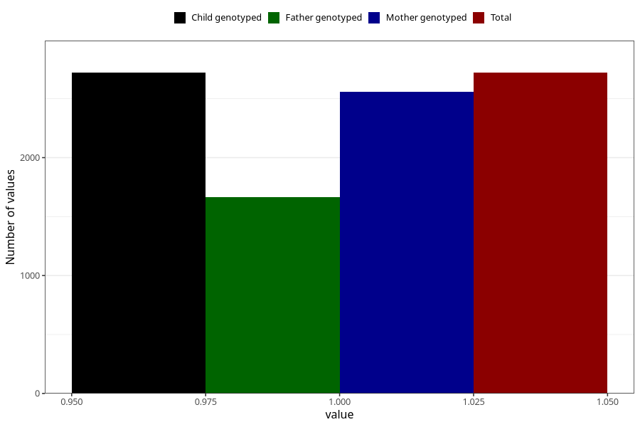

# formula_colett_omega3_3m
Variable mapping to `DD66` in `Skjema4_6mnd_v12`.
- Number of values:

| Value | Total | Child genotyped | Mother genotyped | Father genotyped |
| ----- | ----- | --------------- | ---------------- | ---------------- |
| Missing | 78303 | 78303 | 73671 | 51643 |
| Non-missing | 2720 | 2720 | 2558 | 1668 |
| 1 | 2720 | 2720 | 2558 | 1668 |

