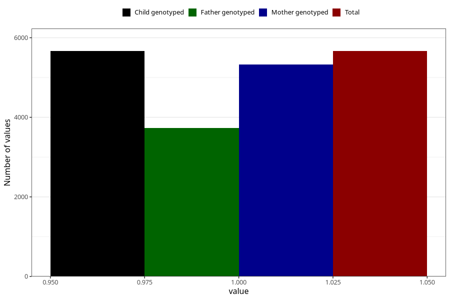

# formula_nan_0m
Variable mapping to `DD70` in `Skjema4_6mnd_v12`.
- Number of values:

| Value | Total | Child genotyped | Mother genotyped | Father genotyped |
| ----- | ----- | --------------- | ---------------- | ---------------- |
| Missing | 75359 | 75359 | 70902 | 49577 |
| Non-missing | 5664 | 5664 | 5327 | 3734 |
| 1 | 5664 | 5664 | 5327 | 3734 |

