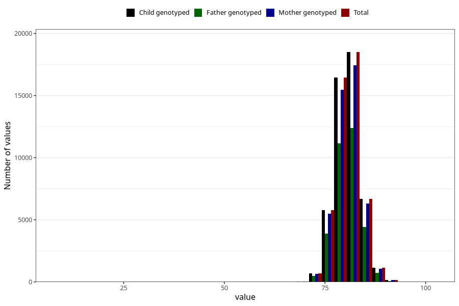

# length_15_18m_1
Variable mapping to `EE399` in `Skjema5_18mnd_v12`.
- Number of values:

| Value | Total | Child genotyped | Mother genotyped | Father genotyped |
| ----- | ----- | --------------- | ---------------- | ---------------- |
| Missing | 31584 | 31584 | 29621 | 20123 |
| Non-missing | 49439 | 49439 | 46608 | 33188 |
| 25th percentile | 78.5 | 78.5 | 78.5 | 78.5 |
| 50th percentile | 80.5 | 80.5 | 80.5 | 80.5 |
| 75th percentile | 82.6 | 82.6 | 82.6 | 82.5 |
| Mean | 80.6803434535488 | 80.6803434535488 | 80.6775381908685 | 80.6599764975292 |
| Standard deviation | 3.12066234501328 | 3.12066234501328 | 3.13163700243459 | 3.06397504453657 |
| N | 49439 | 49439 | 46608 | 33188 |

