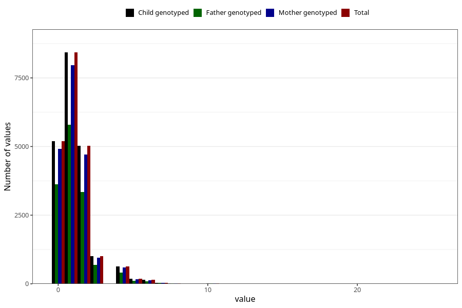

# n_slices_crisp_bread_7y
Variable mapping to `JJ342` in `Skjema7aar_v12`.
- Number of values:

| Value | Total | Child genotyped | Mother genotyped | Father genotyped |
| ----- | ----- | --------------- | ---------------- | ---------------- |
| Missing | 60319 | 60319 | 56727 | 39173 |
| Non-missing | 20704 | 20704 | 19502 | 14138 |
| 0 | 5194 | 5194 | 4907 | 3623 |
| 1 | 8426 | 8426 | 7970 | 5799 |
| 2 | 5025 | 5025 | 4704 | 3352 |
| 3 | 1012 | 1012 | 952 | 696 |
| 4 | 639 | 639 | 593 | 403 |
| 5 | 179 | 179 | 163 | 118 |
| 6 | 141 | 141 | 132 | 85 |
| 7 | 38 | 38 | 36 | 26 |
| 8 | 24 | 24 | 21 | 15 |
| 9 | 4 | 4 | 4 | 3 |
| 10 | 9 | 9 | 9 | 8 |
| 11 | 1 | 1 | 1 | 1 |
| 12 | 2 | 2 | 2 | 2 |
| 14 | 4 | 4 | 4 | 3 |
| 15 | 1 | 1 | 0 | 0 |
| 16 | 1 | 1 | 1 | 1 |
| 20 | 3 | 3 | 3 | 2 |
| 25 | 1 | 1 | 0 | 1 |

