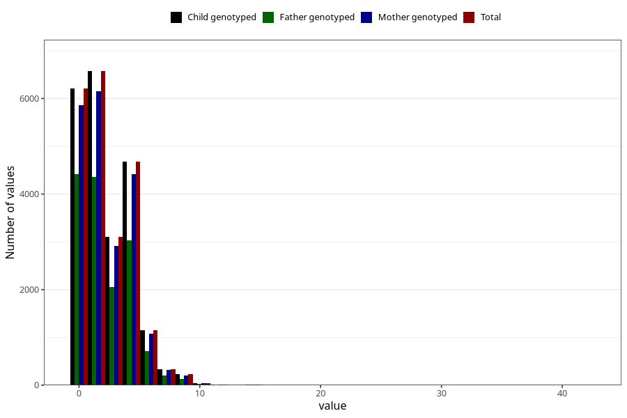

# n_slices_medium_refined_bread_daily_7y
Variable mapping to `JJ340` in `Skjema7aar_v12`.
- Number of values:

| Value | Total | Child genotyped | Mother genotyped | Father genotyped |
| ----- | ----- | --------------- | ---------------- | ---------------- |
| Missing | 58693 | 58693 | 55207 | 38370 |
| Non-missing | 22330 | 22330 | 21022 | 14941 |
| 25th percentile | 0 | 0 | 0 | 0 |
| 50th percentile | 2 | 2 | 2 | 2 |
| 75th percentile | 4 | 4 | 4 | 4 |
| Mean | 2.33627407075683 | 2.33627407075683 | 2.33698030634573 | 2.25172344555251 |
| Standard deviation | 2.09360338973462 | 2.09360338973462 | 2.09383181142341 | 2.06588708125147 |
| N | 22330 | 22330 | 21022 | 14941 |

