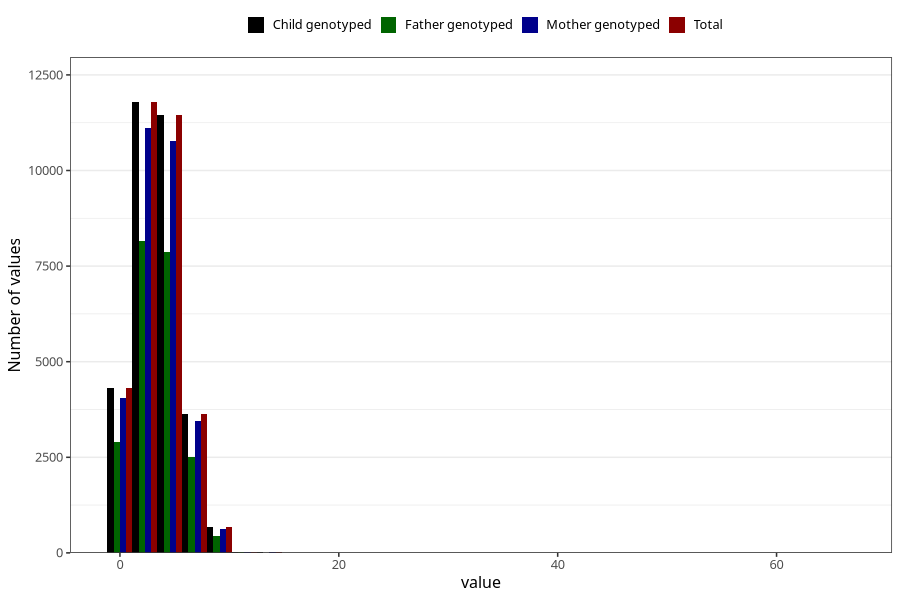

# n_slices_whole_grain_bread_7y
Variable mapping to `JJ341` in `Skjema7aar_v12`.
- Number of values:

| Value | Total | Child genotyped | Mother genotyped | Father genotyped |
| ----- | ----- | --------------- | ---------------- | ---------------- |
| Missing | 49107 | 49107 | 46176 | 31384 |
| Non-missing | 31916 | 31916 | 30053 | 21927 |
| 25th percentile | 2 | 2 | 2 | 2 |
| 50th percentile | 3 | 3 | 3 | 3 |
| 75th percentile | 5 | 5 | 5 | 5 |
| Mean | 3.48731043990475 | 3.48731043990475 | 3.49003427278475 | 3.49596388014776 |
| Standard deviation | 1.99271633700193 | 1.99271633700193 | 1.99663854065338 | 1.95863211248245 |
| N | 31916 | 31916 | 30053 | 21927 |

