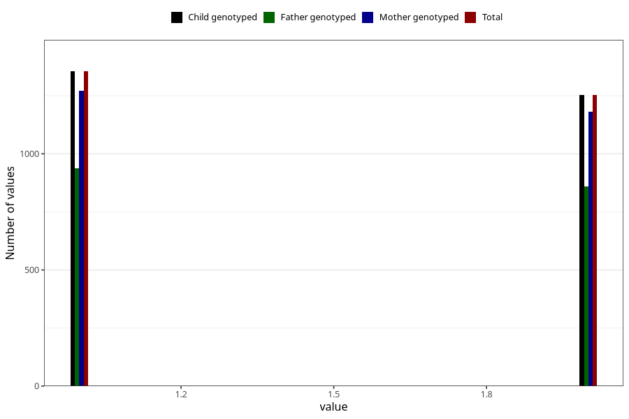

# omega3_capsules_amount_per_time_7y
Variable mapping to `JJ533` in `Skjema7aar_v12`.
Variable mapping to `JJ533` in `Skjema7aar_v12`.
- Number of values:

| Value | Total | Child genotyped | Mother genotyped | Father genotyped |
| ----- | ----- | --------------- | ---------------- | ---------------- |
| Missing | 78312 | 78312 | 73683 | 51446 |
| Non-missing | 2711 | 2711 | 2546 | 1865 |
| 3+ at a time | 102 | 102 | 93 |66 |
| More than 1 check box filled in | 1 | 1 | 1 |1 |
| 1 | 1355 | 1355 | 1271 | 937 |
| 2 | 1253 | 1253 | 1181 | 861 |

