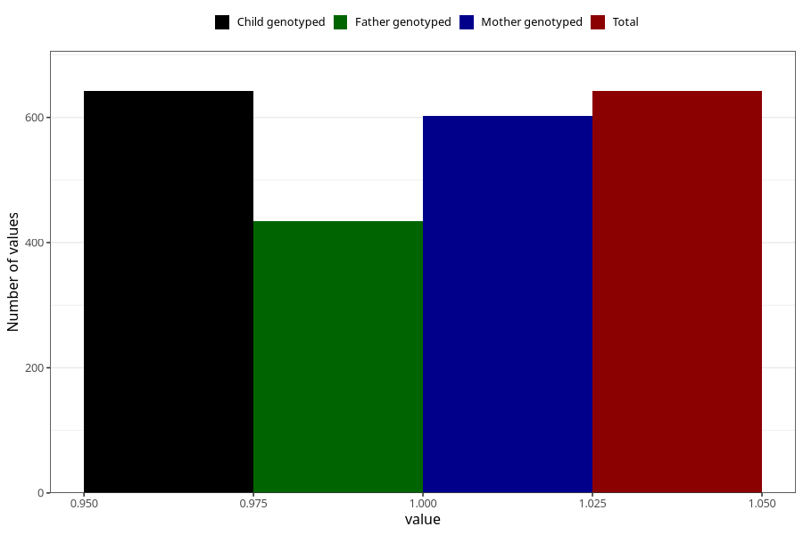

# other_milk_1m
Variable mapping to `DD85` in `Skjema4_6mnd_v12`.
- Number of values:

| Value | Total | Child genotyped | Mother genotyped | Father genotyped |
| ----- | ----- | --------------- | ---------------- | ---------------- |
| Missing | 80381 | 80381 | 75626 | 52877 |
| Non-missing | 642 | 642 | 603 | 434 |
| 1 | 642 | 642 | 603 | 434 |

