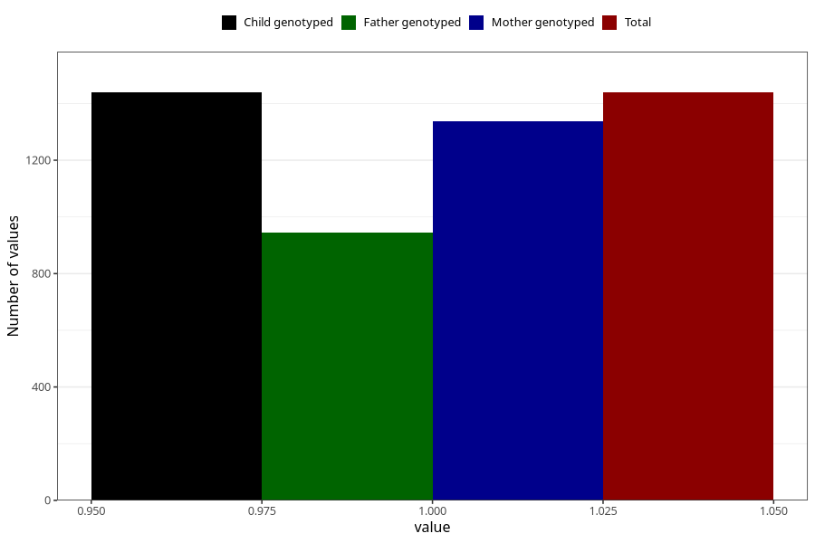

# other_milk_3m
Variable mapping to `DD87` in `Skjema4_6mnd_v12`.
- Number of values:

| Value | Total | Child genotyped | Mother genotyped | Father genotyped |
| ----- | ----- | --------------- | ---------------- | ---------------- |
| Missing | 79584 | 79584 | 74892 | 52366 |
| Non-missing | 1439 | 1439 | 1337 | 945 |
| 1 | 1439 | 1439 | 1337 | 945 |

