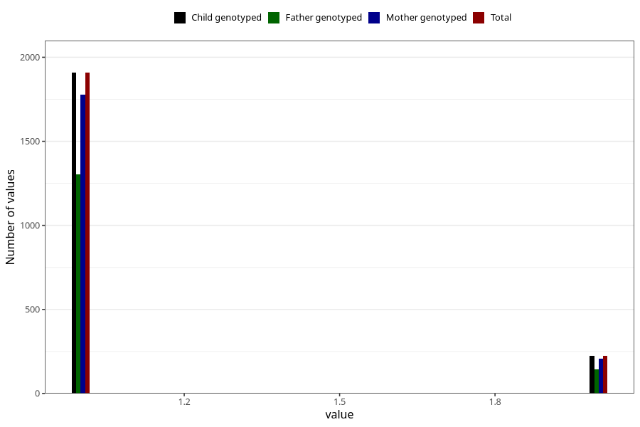

# other_supplement_capsules_amount_per_time_7y
Variable mapping to `JJ542` in `Skjema7aar_v12`.
Variable mapping to `JJ542` in `Skjema7aar_v12`.
- Number of values:

| Value | Total | Child genotyped | Mother genotyped | Father genotyped |
| ----- | ----- | --------------- | ---------------- | ---------------- |
| Missing | 78837 | 78837 | 74195 | 51831 |
| Non-missing | 2186 | 2186 | 2034 | 1480 |
| 3+ at a time | 54 | 54 | 47 |31 |
| More than 1 check box filled in | 2 | 2 | 2 |2 |
| 1 | 1908 | 1908 | 1779 | 1302 |
| 2 | 222 | 222 | 206 | 145 |

