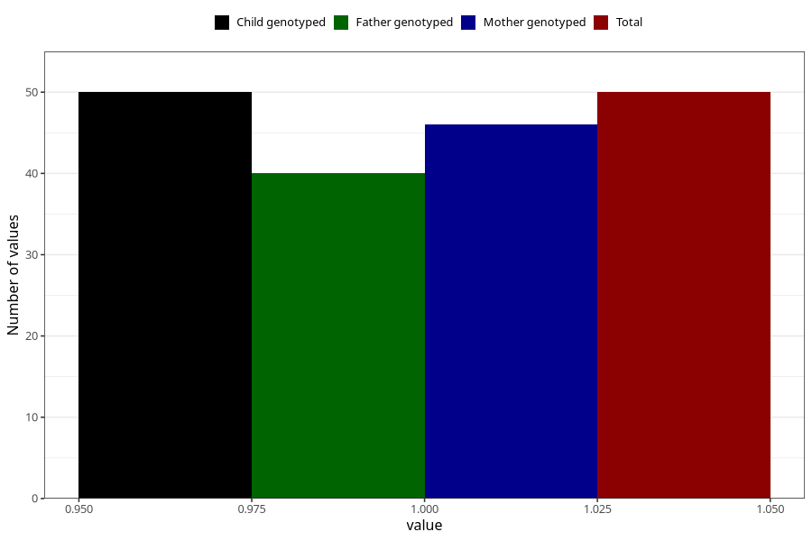

# father_eating_disorders
Variable mapping to `FF389` in `SkjemaFar_v12`.
- Number of values:

| Value | Total | Child genotyped | Mother genotyped | Father genotyped |
| ----- | ----- | --------------- | ---------------- | ---------------- |
| Missing | 80973 | 80973 | 76183 | 53271 |
| Non-missing | 50 | 50 | 46 | 40 |
| 1 | 50 | 50 | 46 | 40 |

