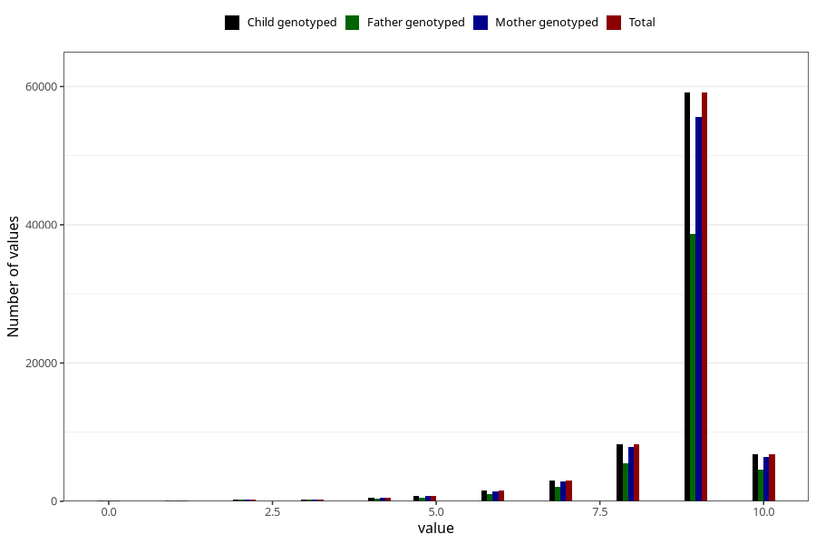

# apgar_1
Variable mapping to `APGAR1` in `MFR_541_v12`.
- Number of values:

| Value | Total | Child genotyped | Mother genotyped | Father genotyped |
| ----- | ----- | --------------- | ---------------- | ---------------- |
| Missing | 160 | 160 | 149 | 97 |
| Non-missing | 80863 | 80863 | 76080 | 53214 |
| 0 | 94 | 94 | 89 | 63 |
| 1 | 135 | 135 | 123 | 90 |
| 2 | 254 | 254 | 234 | 182 |
| 3 | 310 | 310 | 292 | 225 |
| 4 | 509 | 509 | 479 | 332 |
| 5 | 821 | 821 | 783 | 549 |
| 6 | 1559 | 1559 | 1446 | 1003 |
| 7 | 2992 | 2992 | 2817 | 2043 |
| 8 | 8291 | 8291 | 7788 | 5530 |
| 9 | 59115 | 59115 | 55657 | 38643 |
| 10 | 6783 | 6783 | 6372 | 4554 |

