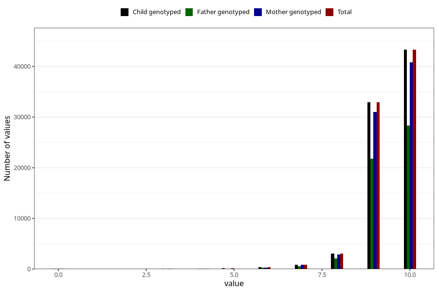

# apgar_5
Variable mapping to `APGAR5` in `MFR_541_v12`.
- Number of values:

| Value | Total | Child genotyped | Mother genotyped | Father genotyped |
| ----- | ----- | --------------- | ---------------- | ---------------- |
| Missing | 150 | 150 | 142 | 96 |
| Non-missing | 80873 | 80873 | 76087 | 53215 |
| 0 | 61 | 61 | 58 | 42 |
| 1 | 11 | 11 | 11 | 5 |
| 2 | 12 | 12 | 11 | 11 |
| 3 | 43 | 43 | 37 | 28 |
| 4 | 88 | 88 | 85 | 62 |
| 5 | 141 | 141 | 129 | 96 |
| 6 | 348 | 348 | 321 | 235 |
| 7 | 873 | 873 | 817 | 589 |
| 8 | 3046 | 3046 | 2846 | 2064 |
| 9 | 32959 | 32959 | 31006 | 21748 |
| 10 | 43291 | 43291 | 40766 | 28335 |

