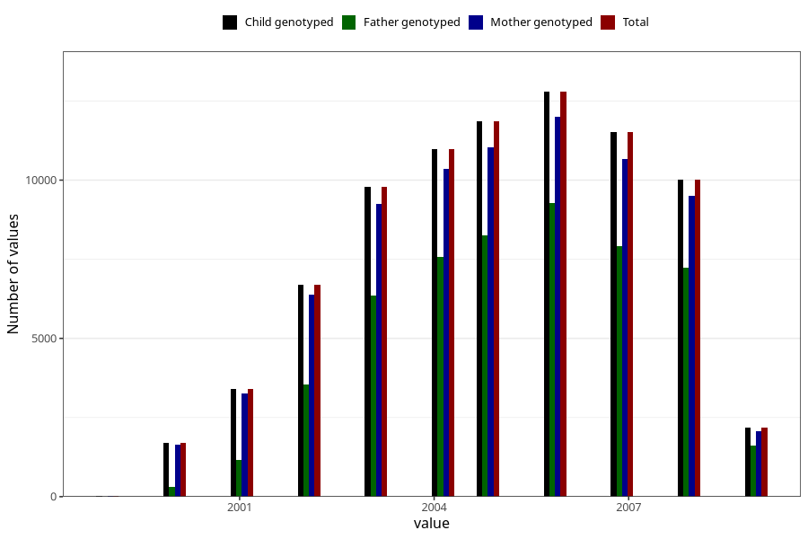

# birth_year
Variable mapping to `FAAR` in `MFR_541_v12`.
- Number of values:

| Value | Total | Child genotyped | Mother genotyped | Father genotyped |
| ----- | ----- | --------------- | ---------------- | ---------------- |
| Missing | 66 | 66 | 61 | 44 |
| Non-missing | 80957 | 80957 | 76168 | 53267 |
| 1999 | 29 | 29 | 27 | 6 |
| 2000 | 1685 | 1685 | 1632 | 295 |
| 2001 | 3409 | 3409 | 3268 | 1170 |
| 2002 | 6680 | 6680 | 6371 | 3552 |
| 2003 | 9793 | 9793 | 9248 | 6361 |
| 2004 | 10989 | 10989 | 10361 | 7562 |
| 2005 | 11860 | 11860 | 11048 | 8251 |
| 2006 | 12789 | 12789 | 12008 | 9287 |
| 2007 | 11517 | 11517 | 10656 | 7913 |
| 2008 | 10014 | 10014 | 9489 | 7243 |
| 2009 | 2192 | 2192 | 2060 | 1627 |

