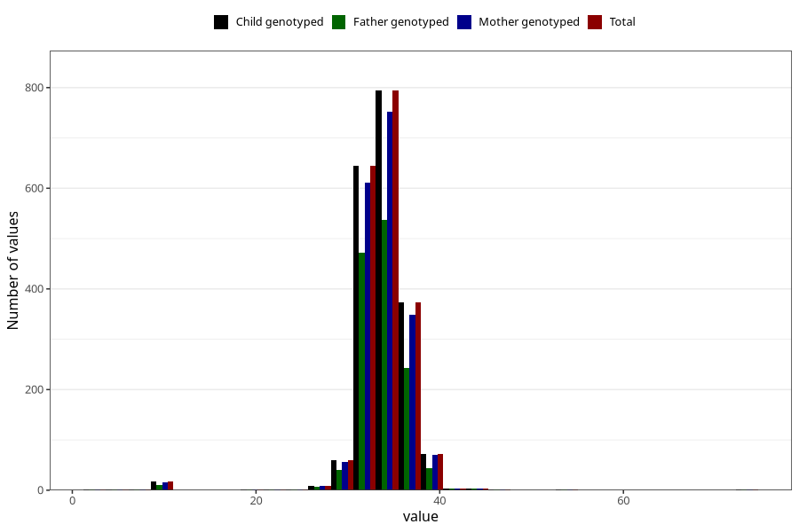

# crown_rump_length
Variable mapping to `SETE_ISSE` in `MFR_541_v12`.
- Number of values:

| Value | Total | Child genotyped | Mother genotyped | Father genotyped |
| ----- | ----- | --------------- | ---------------- | ---------------- |
| Missing | 79033 | 79033 | 74346 | 51938 |
| Non-missing | 1990 | 1990 | 1883 | 1373 |
| 25th percentile | 33 | 33 | 33 | 33 |
| 50th percentile | 34 | 34 | 34 | 34 |
| 75th percentile | 35 | 35 | 35 | 35 |
| Mean | 33.9125628140703 | 33.9125628140703 | 33.9198088157196 | 33.8375819373634 |
| Standard deviation | 3.50886157712798 | 3.50886157712798 | 3.49136563106836 | 3.66438027208545 |
| N | 1990 | 1990 | 1883 | 1373 |

