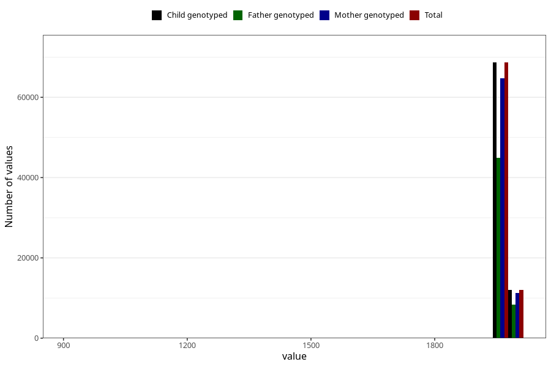

# father_birth_year
Variable mapping to `far_faar_trunkert` in `MFR_541_v12`.
- Number of values:

| Value | Total | Child genotyped | Mother genotyped | Father genotyped |
| ----- | ----- | --------------- | ---------------- | ---------------- |
| Missing | 248 | 248 | 223 | 58 |
| Non-missing | 80775 | 80775 | 76006 | 53253 |
| 25th percentile | 1968 | 1968 | 1968 | 1969 |
| 50th percentile | 1972 | 1972 | 1972 | 1973 |
| 75th percentile | 1976 | 1976 | 1976 | 1976 |
| Mean | 1971.23007118539 | 1971.23007118539 | 1971.19973423151 | 1971.98944660395 |
| Standard deviation | 25.2009897588949 | 25.2009897588949 | 25.1039401907261 | 16.1507885085217 |
| N | 80775 | 80775 | 76006 | 53253 |

