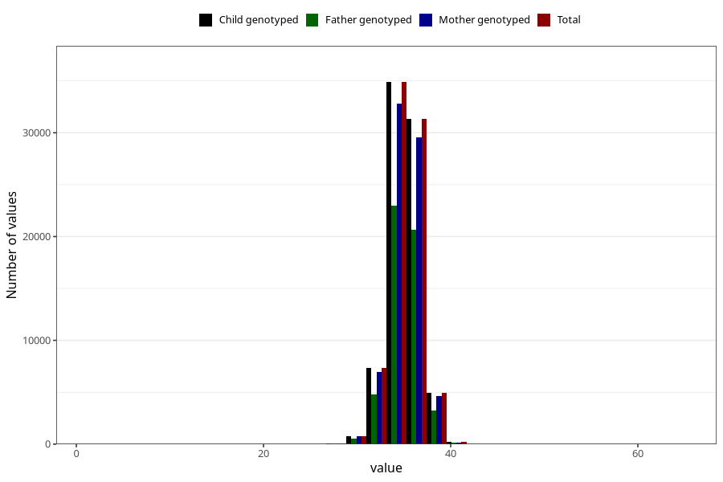

# hc_birth
Variable mapping to `HODE` in `MFR_541_v12`.
- Number of values:

| Value | Total | Child genotyped | Mother genotyped | Father genotyped |
| ----- | ----- | --------------- | ---------------- | ---------------- |
| Missing | 1324 | 1324 | 1237 | 884 |
| Non-missing | 79699 | 79699 | 74992 | 52427 |
| 25th percentile | 34 | 34 | 34 | 34 |
| 50th percentile | 35 | 35 | 35 | 35 |
| 75th percentile | 36 | 36 | 36 | 36 |
| Mean | 35.3037804740336 | 35.3037804740336 | 35.3025789417538 | 35.3020771739752 |
| Standard deviation | 1.62930918938991 | 1.62930918938991 | 1.63257330164348 | 1.62802327009568 |
| N | 79699 | 79699 | 74992 | 52427 |

