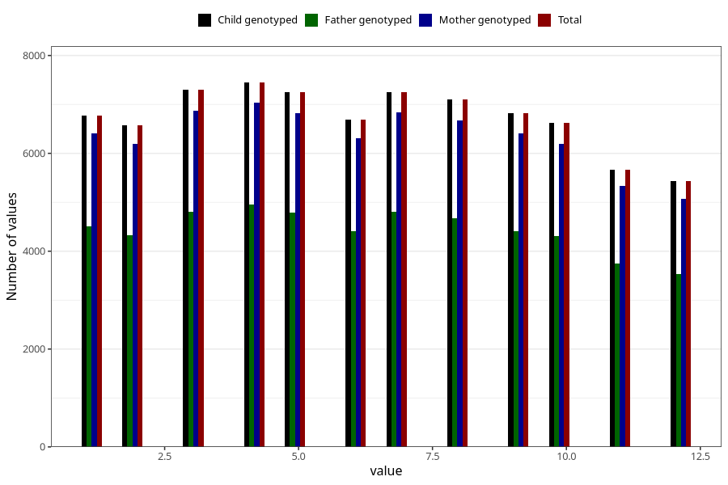

# month_of_delivery
Variable mapping to `FMND` in `MFR_541_v12`.
- Number of values:

| Value | Total | Child genotyped | Mother genotyped | Father genotyped |
| ----- | ----- | --------------- | ---------------- | ---------------- |
| Missing | 66 | 66 | 61 | 44 |
| Non-missing | 80957 | 80957 | 76168 | 53267 |
| 1 | 6777 | 6777 | 6411 | 4504 |
| 2 | 6577 | 6577 | 6200 | 4321 |
| 3 | 7304 | 7304 | 6863 | 4801 |
| 4 | 7446 | 7446 | 7038 | 4952 |
| 5 | 7248 | 7248 | 6819 | 4792 |
| 6 | 6697 | 6697 | 6314 | 4413 |
| 7 | 7250 | 7250 | 6830 | 4803 |
| 8 | 7110 | 7110 | 6669 | 4672 |
| 9 | 6824 | 6824 | 6416 | 4412 |
| 10 | 6624 | 6624 | 6198 | 4306 |
| 11 | 5672 | 5672 | 5337 | 3754 |
| 12 | 5428 | 5428 | 5073 | 3537 |

