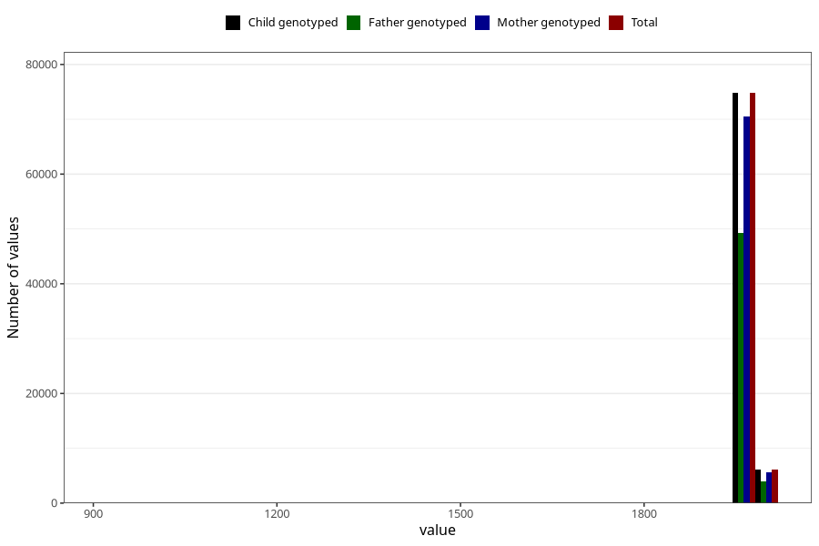

# mother_birth_year
Variable mapping to `mor_faar_trunkert` in `MFR_541_v12`.
- Number of values:

| Value | Total | Child genotyped | Mother genotyped | Father genotyped |
| ----- | ----- | --------------- | ---------------- | ---------------- |
| Missing | 66 | 66 | 61 | 44 |
| Non-missing | 80957 | 80957 | 76168 | 53267 |
| 25th percentile | 1971 | 1971 | 1971 | 1971 |
| 50th percentile | 1974 | 1974 | 1974 | 1975 |
| 75th percentile | 1978 | 1978 | 1978 | 1978 |
| Mean | 1973.96692071099 | 1973.96692071099 | 1973.91877166264 | 1974.27240129912 |
| Standard deviation | 21.0962871229239 | 21.0962871229239 | 21.3904281104932 | 20.8711125490975 |
| N | 80957 | 80957 | 76168 | 53267 |

