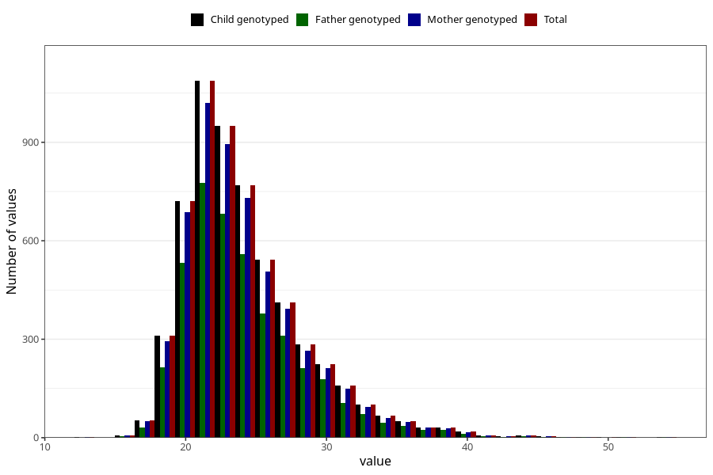

# mother_bmi_before
Variable mapping to `KMI_FOER` in `MFR_541_v12`.
- Number of values:

| Value | Total | Child genotyped | Mother genotyped | Father genotyped |
| ----- | ----- | --------------- | ---------------- | ---------------- |
| Missing | 75170 | 75170 | 70710 | 49094 |
| Non-missing | 5853 | 5853 | 5519 | 4217 |
| 25th percentile | 21.19 | 21.19 | 21.19 | 21.2 |
| 50th percentile | 23.14 | 23.14 | 23.14 | 23.18 |
| 75th percentile | 26.22 | 26.22 | 26.13 | 26.3 |
| Mean | 24.1761182299675 | 24.1761182299675 | 24.1506359847798 | 24.1934882617975 |
| Standard deviation | 4.38077564095308 | 4.38077564095308 | 4.34189182947697 | 4.33710633525385 |
| N | 5853 | 5853 | 5519 | 4217 |

