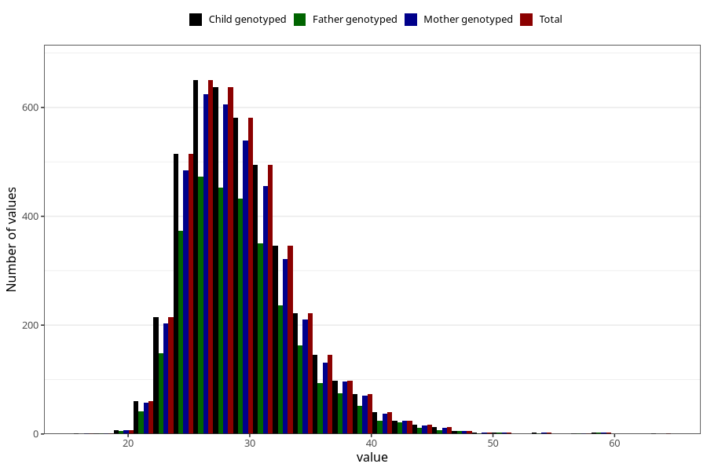

# mother_bmi_end
Variable mapping to `KMI_SLUTT` in `MFR_541_v12`.
- Number of values:

| Value | Total | Child genotyped | Mother genotyped | Father genotyped |
| ----- | ----- | --------------- | ---------------- | ---------------- |
| Missing | 76863 | 76863 | 72313 | 50335 |
| Non-missing | 4160 | 4160 | 3916 | 2976 |
| 25th percentile | 26.03 | 26.03 | 26.03 | 26.03 |
| 50th percentile | 28.63 | 28.63 | 28.55 | 28.625 |
| 75th percentile | 31.7475 | 31.7475 | 31.74 | 31.6225 |
| Mean | 29.3233725961538 | 29.3233725961538 | 29.2984269662921 | 29.3098689516129 |
| Standard deviation | 4.67674951757377 | 4.67674951757377 | 4.66539263698615 | 4.65732760855502 |
| N | 4160 | 4160 | 3916 | 2976 |

