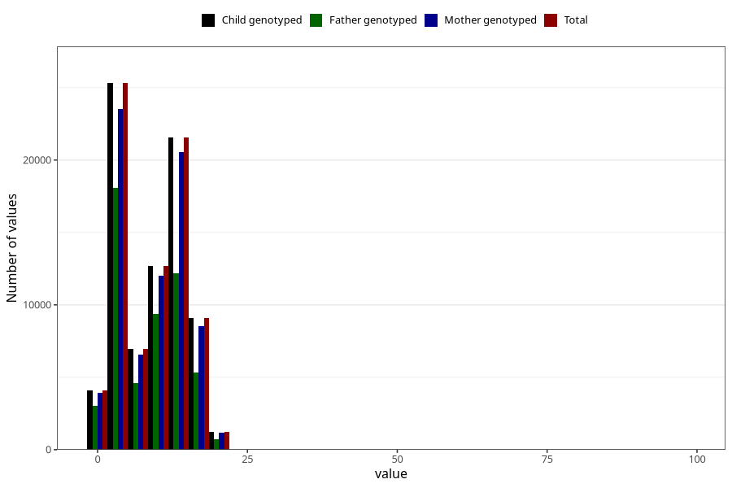

# mother_county_residence_delivery
Variable mapping to `BOFYLKE` in `MFR_541_v12`.
- Number of values:

| Value | Total | Child genotyped | Mother genotyped | Father genotyped |
| ----- | ----- | --------------- | ---------------- | ---------------- |
| Missing | 66 | 66 | 61 | 44 |
| Non-missing | 80957 | 80957 | 76168 | 53267 |
| 25th percentile | 3 | 3 | 3 | 3 |
| 50th percentile | 10 | 10 | 10 | 9 |
| 75th percentile | 12 | 12 | 12 | 12 |
| Mean | 8.83630816359302 | 8.83630816359302 | 8.85818191366453 | 8.38843937146826 |
| Standard deviation | 5.59055414200627 | 5.59055414200627 | 5.58801038220756 | 5.54784455661508 |
| N | 80957 | 80957 | 76168 | 53267 |

