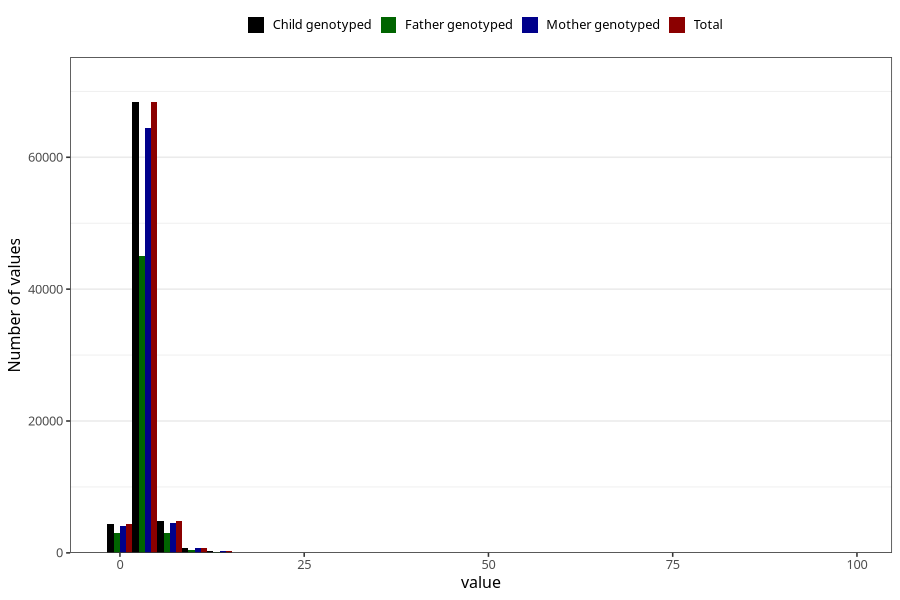

# mother_days_hospital_birth
Variable mapping to `LIGGEDOGN_MOR` in `MFR_541_v12`.
- Number of values:

| Value | Total | Child genotyped | Mother genotyped | Father genotyped |
| ----- | ----- | --------------- | ---------------- | ---------------- |
| Missing | 2475 | 2475 | 2282 | 1695 |
| Non-missing | 78548 | 78548 | 73947 | 51616 |
| 25th percentile | 3 | 3 | 3 | 2 |
| 50th percentile | 3 | 3 | 3 | 3 |
| 75th percentile | 4 | 4 | 4 | 4 |
| Mean | 3.45004328563426 | 3.45004328563426 | 3.45386560644786 | 3.39824860508369 |
| Standard deviation | 2.08402733843122 | 2.08402733843122 | 2.10023021496168 | 2.11115873803075 |
| N | 78548 | 78548 | 73947 | 51616 |

