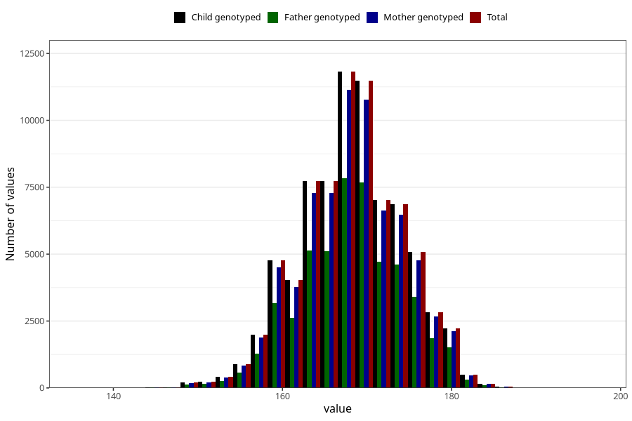

# mother_height
Variable mapping to `MORS_HOYDE` in `MFR_541_v12`.
Variable mapping to `MORS_HOYDE` in `MFR_541_v12`.
- Number of values:

| Value | Total | Child genotyped | Mother genotyped | Father genotyped |
| ----- | ----- | --------------- | ---------------- | ---------------- |
| Missing | 4985 | 4985 | 4650 | 2772 |
| Non-missing | 76038 | 76038 | 71579 | 50539 |
| 25th percentile | 164 | 164 | 164 | 164 |
| 50th percentile | 168 | 168 | 168 | 168 |
| 75th percentile | 172 | 172 | 172 | 172 |
| Mean | 168.175990951892 | 168.175990951892 | 168.178767515612 | 168.217594333089 |
| Standard deviation | 5.8902050630033 | 5.8902050630033 | 5.89274057169325 | 5.87946338177762 |
| N | 76038 | 76038 | 71579 | 50539 |

