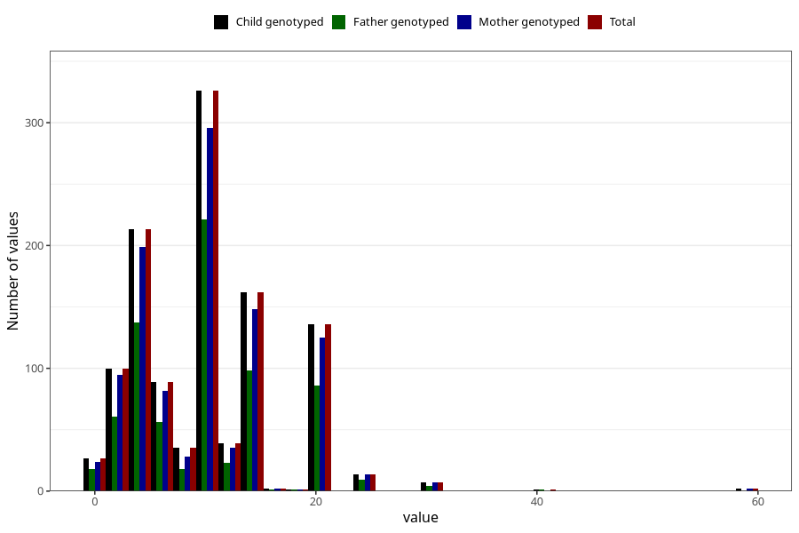

# mother_smoking_before_pregnancy_cigarettes_per_day
Variable mapping to `ROYK_FOER_ANT` in `MFR_541_v12`.
- Number of values:

| Value | Total | Child genotyped | Mother genotyped | Father genotyped |
| ----- | ----- | --------------- | ---------------- | ---------------- |
| Missing | 79869 | 79869 | 75171 | 52577 |
| Non-missing | 1154 | 1154 | 1058 | 734 |
| 25th percentile | 5 | 5 | 5 | 5 |
| 50th percentile | 10 | 10 | 10 | 10 |
| 75th percentile | 15 | 15 | 15 | 15 |
| Mean | 10.2487001733102 | 10.2487001733102 | 10.2296786389414 | 10.1430517711172 |
| Standard deviation | 6.21008489663943 | 6.21008489663943 | 6.23606777064314 | 5.84193565774561 |
| N | 1154 | 1154 | 1058 | 734 |

