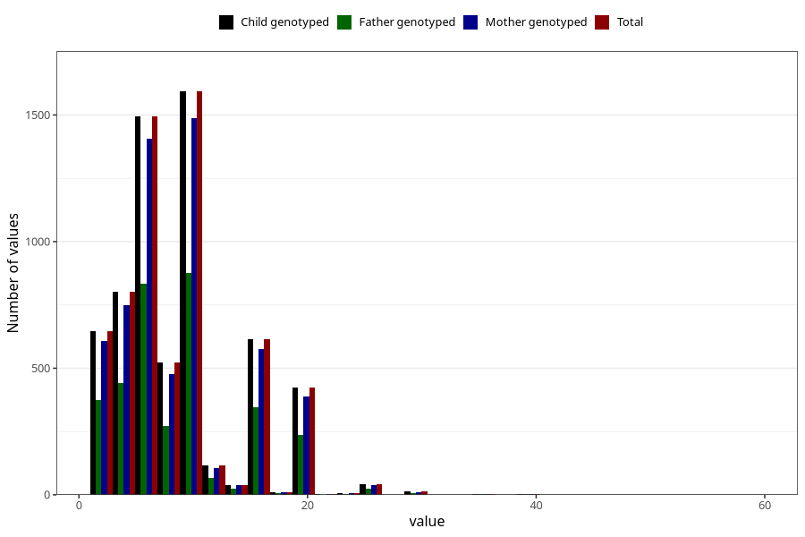

# mother_smoking_beginning_cigarettes_per_day
Variable mapping to `ROYK_BEG_ANT` in `MFR_541_v12`.
- Number of values:

| Value | Total | Child genotyped | Mother genotyped | Father genotyped |
| ----- | ----- | --------------- | ---------------- | ---------------- |
| Missing | 74687 | 74687 | 70320 | 49795 |
| Non-missing | 6336 | 6336 | 5909 | 3516 |
| 25th percentile | 5 | 5 | 5 | 5 |
| 50th percentile | 7 | 7 | 7 | 7 |
| 75th percentile | 10 | 10 | 10 | 10 |
| Mean | 8.38557449494949 | 8.38557449494949 | 8.36419021831105 | 8.38424345847554 |
| Standard deviation | 5.42302148600772 | 5.42302148600772 | 5.41131901684461 | 5.4800786791187 |
| N | 6336 | 6336 | 5909 | 3516 |

