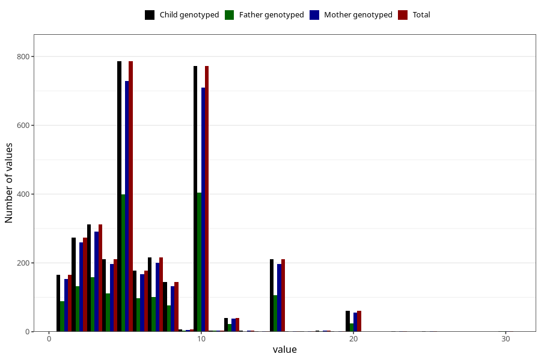

# mother_smoking_end_cigarettes_per_day
Variable mapping to `ROYK_AVSL_ANT` in `MFR_541_v12`.
- Number of values:

| Value | Total | Child genotyped | Mother genotyped | Father genotyped |
| ----- | ----- | --------------- | ---------------- | ---------------- |
| Missing | 77626 | 77626 | 73076 | 51578 |
| Non-missing | 3397 | 3397 | 3153 | 1733 |
| 25th percentile | 4 | 4 | 4 | 4 |
| 50th percentile | 5 | 5 | 5 | 5 |
| 75th percentile | 10 | 10 | 10 | 10 |
| Mean | 6.81336473358846 | 6.81336473358846 | 6.79543292102759 | 6.75476053087132 |
| Standard deviation | 4.12445068052774 | 4.12445068052774 | 4.11451922771953 | 3.99644568020617 |
| N | 3397 | 3397 | 3153 | 1733 |

