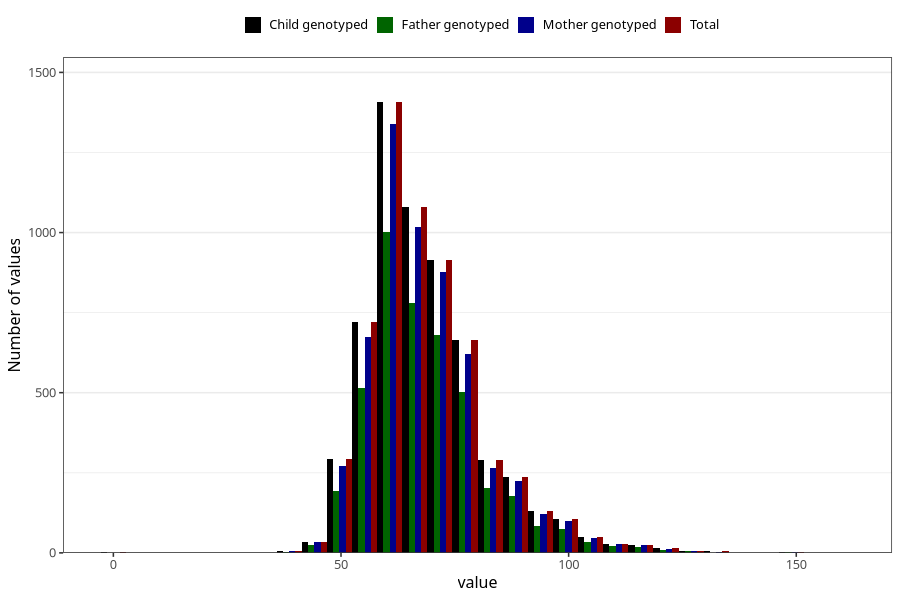

# mother_weight_before
Variable mapping to `MORS_VEKT_FOER` in `MFR_541_v12`.
- Number of values:

| Value | Total | Child genotyped | Mother genotyped | Father genotyped |
| ----- | ----- | --------------- | ---------------- | ---------------- |
| Missing | 75000 | 75000 | 70553 | 48976 |
| Non-missing | 6023 | 6023 | 5676 | 4335 |
| 25th percentile | 60 | 60 | 60 | 60 |
| 50th percentile | 66 | 66 | 66 | 66 |
| 75th percentile | 75 | 75 | 75 | 75 |
| Mean | 68.5402623277436 | 68.5402623277436 | 68.4769203664552 | 68.6302191464821 |
| Standard deviation | 13.3211113289562 | 13.3211113289562 | 13.2048180805575 | 13.1263098214012 |
| N | 6023 | 6023 | 5676 | 4335 |

