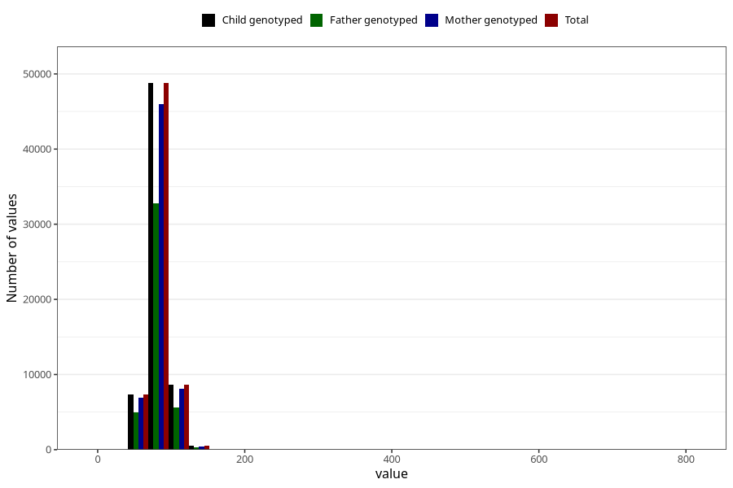

# mother_weight_end
Variable mapping to `MORS_VEKT_SLUTT` in `MFR_541_v12`.
Variable mapping to `MORS_VEKT_SLUTT` in `MFR_541_v12`.
- Number of values:

| Value | Total | Child genotyped | Mother genotyped | Father genotyped |
| ----- | ----- | --------------- | ---------------- | ---------------- |
| Missing | 15680 | 15680 | 14647 | 9638 |
| Non-missing | 65343 | 65343 | 61582 | 43673 |
| 25th percentile | 74 | 74 | 74 | 73.9 |
| 50th percentile | 81 | 81 | 81 | 81 |
| 75th percentile | 90 | 90 | 90 | 90 |
| Mean | 82.8738656015181 | 82.8738656015181 | 82.8353350004871 | 82.8057403887986 |
| Standard deviation | 14.1046366925194 | 14.1046366925194 | 14.1062884056397 | 13.9950168679823 |
| N | 65343 | 65343 | 61582 | 43673 |

