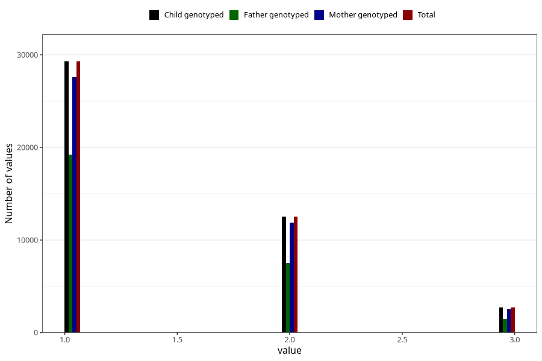

# n_previous_deliveries
Variable mapping to `PARITET_5` in `MFR_541_v12`.
- Number of values:

| Value | Total | Child genotyped | Mother genotyped | Father genotyped |
| ----- | ----- | --------------- | ---------------- | ---------------- |
| Missing | 66 | 66 | 61 | 44 |
| Non-missing | 80957 | 80957 | 76168 | 53267 |
| 0 (primiparous) | 35587 | 35587 | 33406 |24650 |
| 4 or more | 824 | 824 | 767 |404 |
| 1 | 29281 | 29281 | 27580 | 19225 |
| 2 | 12551 | 12551 | 11859 | 7500 |
| 3 | 2714 | 2714 | 2556 | 1488 |

