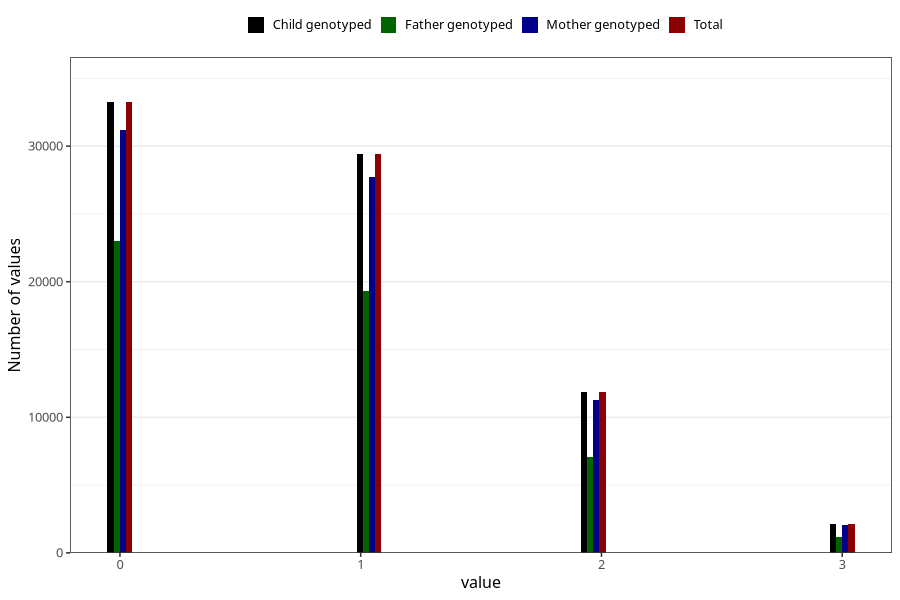

# n_previous_live_births
Variable mapping to `LEVENDEFODTE_5` in `MFR_541_v12`.
- Number of values:

| Value | Total | Child genotyped | Mother genotyped | Father genotyped |
| ----- | ----- | --------------- | ---------------- | ---------------- |
| Missing | 3755 | 3755 | 3550 | 2540 |
| Non-missing | 77268 | 77268 | 72679 | 50771 |
| 4 or more | 543 | 543 | 505 |244 |
| 0 | 33238 | 33238 | 31169 | 23017 |
| 1 | 29448 | 29448 | 27736 | 19325 |
| 2 | 11890 | 11890 | 11239 | 7035 |
| 3 | 2149 | 2149 | 2030 | 1150 |

