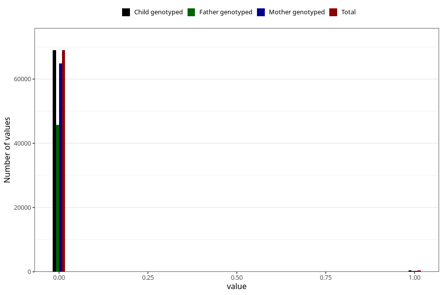

# n_previous_stillbirths
Variable mapping to `DODFODTE_3` in `MFR_541_v12`.
- Number of values:

| Value | Total | Child genotyped | Mother genotyped | Father genotyped |
| ----- | ----- | --------------- | ---------------- | ---------------- |
| Missing | 11659 | 11659 | 11052 | 7427 |
| Non-missing | 69364 | 69364 | 65177 | 45884 |
| 2 or more | 23 | 23 | 22 |11 |
| 0 | 68963 | 68963 | 64806 | 45661 |
| 1 | 378 | 378 | 349 | 212 |

