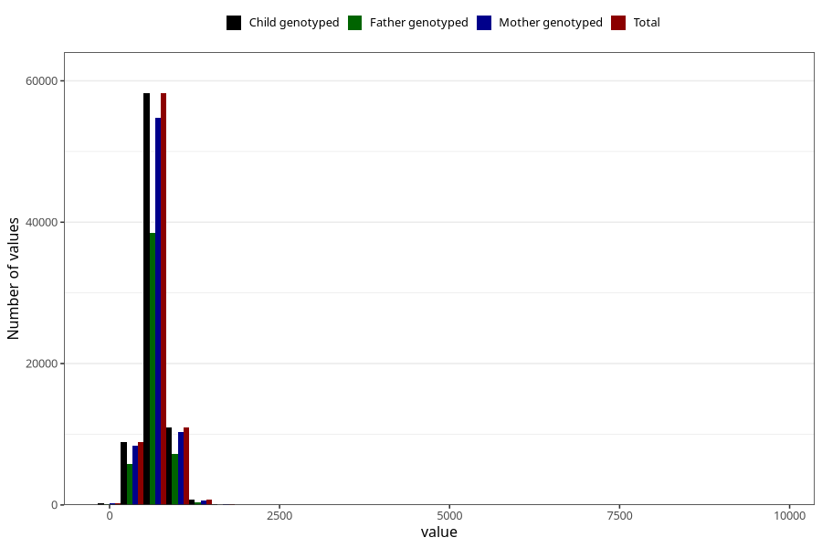

# placental_weight
Variable mapping to `PLACENTAVEKT` in `MFR_541_v12`.
- Number of values:

| Value | Total | Child genotyped | Mother genotyped | Father genotyped |
| ----- | ----- | --------------- | ---------------- | ---------------- |
| Missing | 1834 | 1834 | 1701 | 1175 |
| Non-missing | 79189 | 79189 | 74528 | 52136 |
| 25th percentile | 582 | 582 | 580 | 582 |
| 50th percentile | 670 | 670 | 670 | 670 |
| 75th percentile | 773 | 773 | 772 | 770.25 |
| Mean | 688.029536930634 | 688.029536930634 | 687.997155431516 | 687.286692496548 |
| Standard deviation | 202.026835964382 | 202.026835964382 | 203.512731351096 | 196.6100201543 |
| N | 79189 | 79189 | 74528 | 52136 |

