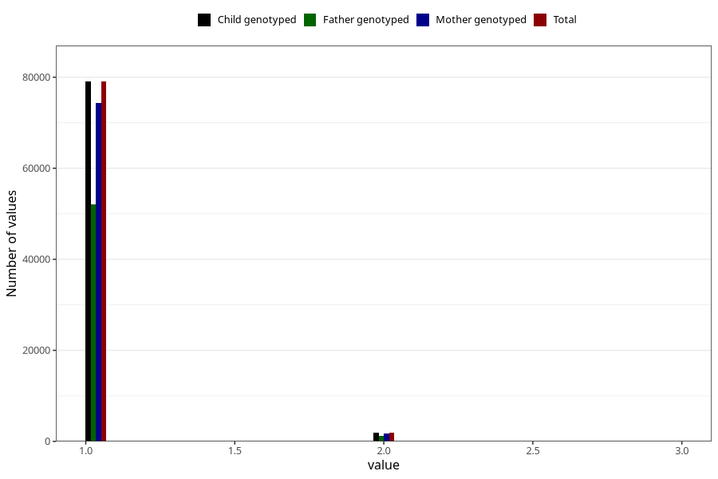

# plurality
Variable mapping to `PLURAL` in `MFR_541_v12`.
- Number of values:

| Value | Total | Child genotyped | Mother genotyped | Father genotyped |
| ----- | ----- | --------------- | ---------------- | ---------------- |
| Missing | 66 | 66 | 61 | 44 |
| Non-missing | 80957 | 80957 | 76168 | 53267 |
| 1 | 79036 | 79036 | 74348 | 52059 |
| 2 | 1902 | 1902 | 1801 | 1201 |
| 3 | 19 | 19 | 19 | 7 |

