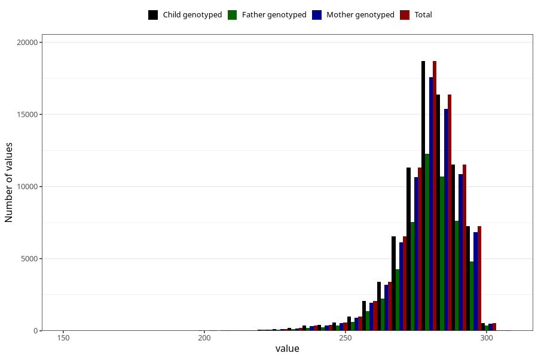

# pregnancy_duration
Variable mapping to `SVLEN_DG` in `MFR_541_v12`.
Variable mapping to `SVLEN_DG` in `MFR_541_v12`.
- Number of values:

| Value | Total | Child genotyped | Mother genotyped | Father genotyped |
| ----- | ----- | --------------- | ---------------- | ---------------- |
| Missing | 393 | 393 | 377 | 255 |
| Non-missing | 80630 | 80630 | 75852 | 53056 |
| 25th percentile | 274 | 274 | 274 | 274 |
| 50th percentile | 281 | 281 | 281 | 281 |
| 75th percentile | 287 | 287 | 287 | 287 |
| Mean | 279.565881185663 | 279.565881185663 | 279.581210778885 | 279.613973914355 |
| Standard deviation | 11.7107628075737 | 11.7107628075737 | 11.7017629681836 | 11.6966002354507 |
| N | 80630 | 80630 | 75852 | 53056 |

