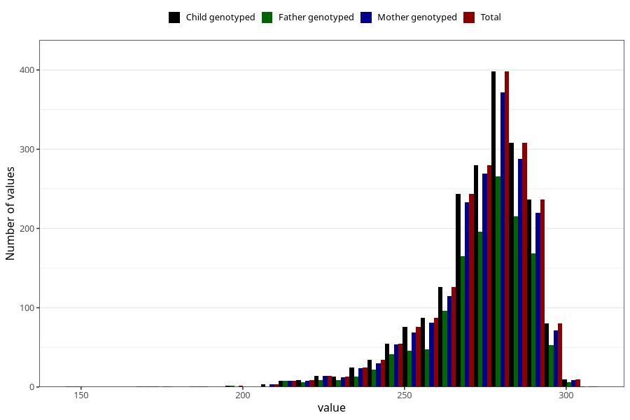

# pregnancy_duration_art
Variable mapping to `SVLEN_ART_DG` in `MFR_541_v12`.
- Number of values:

| Value | Total | Child genotyped | Mother genotyped | Father genotyped |
| ----- | ----- | --------------- | ---------------- | ---------------- |
| Missing | 79009 | 79009 | 74344 | 51938 |
| Non-missing | 2014 | 2014 | 1885 | 1373 |
| 25th percentile | 267 | 267 | 267 | 267 |
| 50th percentile | 277 | 277 | 277 | 277 |
| 75th percentile | 284 | 284 | 284 | 285 |
| Mean | 273.624627606753 | 273.624627606753 | 273.600530503979 | 273.806263656227 |
| Standard deviation | 16.2663226664869 | 16.2663226664869 | 16.146953191948 | 16.2644075204619 |
| N | 2014 | 2014 | 1885 | 1373 |

