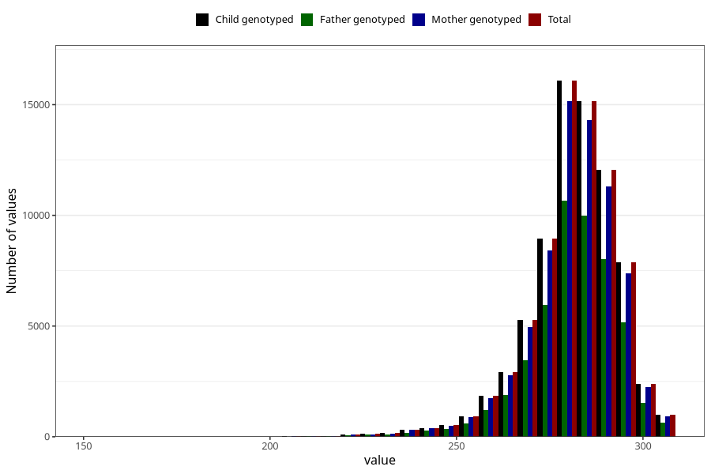

# pregnancy_duration_mens
Variable mapping to `SVLEN_SM_DG` in `MFR_541_v12`.
- Number of values:

| Value | Total | Child genotyped | Mother genotyped | Father genotyped |
| ----- | ----- | --------------- | ---------------- | ---------------- |
| Missing | 4758 | 4758 | 4444 | 3023 |
| Non-missing | 76265 | 76265 | 71785 | 50288 |
| 25th percentile | 275 | 275 | 275 | 275 |
| 50th percentile | 283 | 283 | 283 | 283 |
| 75th percentile | 289 | 289 | 289 | 289 |
| Mean | 281.123831377434 | 281.123831377434 | 281.132033154559 | 281.155365097041 |
| Standard deviation | 12.4561722664557 | 12.4561722664557 | 12.4492844961768 | 12.351866210913 |
| N | 76265 | 76265 | 71785 | 50288 |

