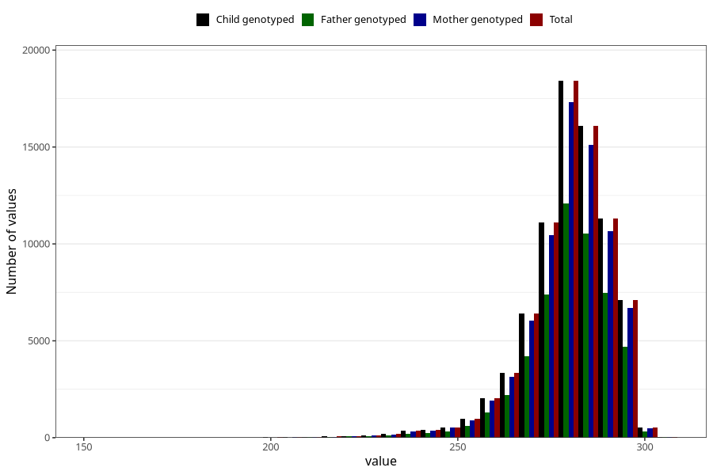

# pregnancy_duration_ultrasound
Variable mapping to `SVLEN_UL_DG` in `MFR_541_v12`.
- Number of values:

| Value | Total | Child genotyped | Mother genotyped | Father genotyped |
| ----- | ----- | --------------- | ---------------- | ---------------- |
| Missing | 1854 | 1854 | 1768 | 1214 |
| Non-missing | 79169 | 79169 | 74461 | 52097 |
| 25th percentile | 274 | 274 | 274 | 274 |
| 50th percentile | 281 | 281 | 281 | 281 |
| 75th percentile | 287 | 287 | 287 | 287 |
| Mean | 279.551339539466 | 279.551339539466 | 279.56844522636 | 279.599228362478 |
| Standard deviation | 11.6847871596176 | 11.6847871596176 | 11.6735191986903 | 11.6672810474291 |
| N | 79169 | 79169 | 74461 | 52097 |

