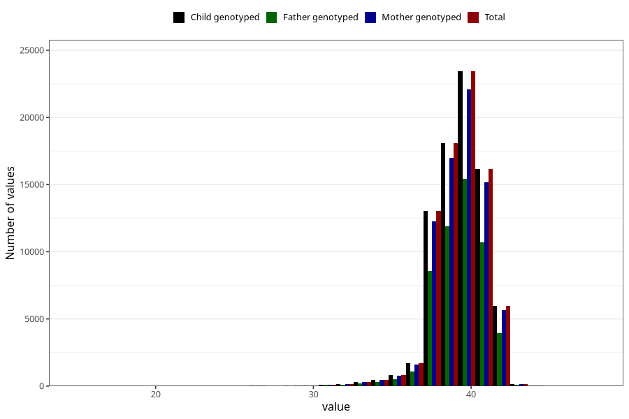

# pregnancy_duration_weeks
Variable mapping to `SVLEN` in `MFR_541_v12`.
- Number of values:

| Value | Total | Child genotyped | Mother genotyped | Father genotyped |
| ----- | ----- | --------------- | ---------------- | ---------------- |
| Missing | 363 | 363 | 349 | 234 |
| Non-missing | 80660 | 80660 | 75880 | 53077 |
| 25th percentile | 39 | 39 | 39 | 39 |
| 50th percentile | 40 | 40 | 40 | 40 |
| 75th percentile | 41 | 41 | 41 | 41 |
| Mean | 39.5128688321349 | 39.5128688321349 | 39.5151159725883 | 39.5203383763212 |
| Standard deviation | 1.7112055047251 | 1.7112055047251 | 1.71069686675991 | 1.71010887231353 |
| N | 80660 | 80660 | 75880 | 53077 |

