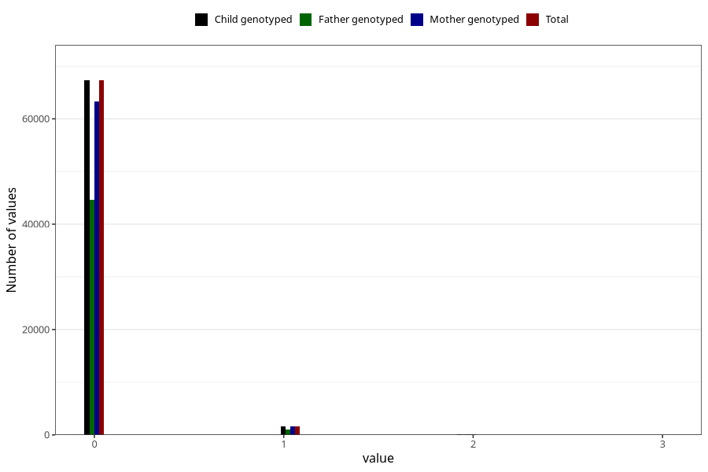

# previous_miscarriages_12_23w
Variable mapping to `SPABORT_23_5` in `MFR_541_v12`.
- Number of values:

| Value | Total | Child genotyped | Mother genotyped | Father genotyped |
| ----- | ----- | --------------- | ---------------- | ---------------- |
| Missing | 11837 | 11837 | 11214 | 7526 |
| Non-missing | 69186 | 69186 | 65015 | 45785 |
| 4 or more | 28 | 28 | 22 |18 |
| 0 | 67291 | 67291 | 63238 | 44572 |
| 1 | 1673 | 1673 | 1575 | 1066 |
| 2 | 159 | 159 | 150 | 104 |
| 3 | 35 | 35 | 30 | 25 |

