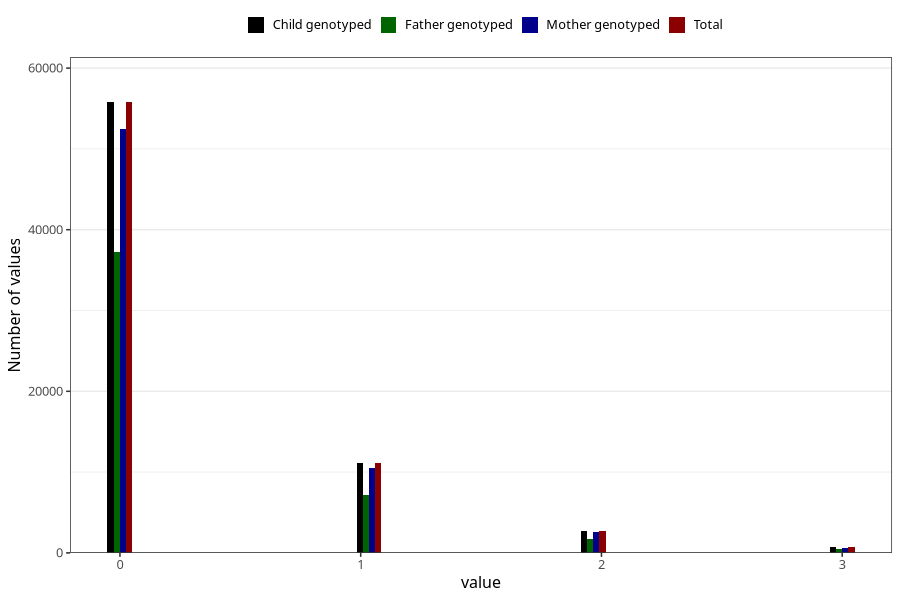

# previous_miscarriages_before_12w
Variable mapping to `SPABORT_12_5` in `MFR_541_v12`.
- Number of values:

| Value | Total | Child genotyped | Mother genotyped | Father genotyped |
| ----- | ----- | --------------- | ---------------- | ---------------- |
| Missing | 10309 | 10309 | 9761 | 6575 |
| Non-missing | 70714 | 70714 | 66468 | 46736 |
| 4 or more | 389 | 389 | 348 |224 |
| 0 | 55778 | 55778 | 52431 | 37242 |
| 1 | 11152 | 11152 | 10496 | 7152 |
| 2 | 2697 | 2697 | 2534 | 1692 |
| 3 | 698 | 698 | 659 | 426 |

