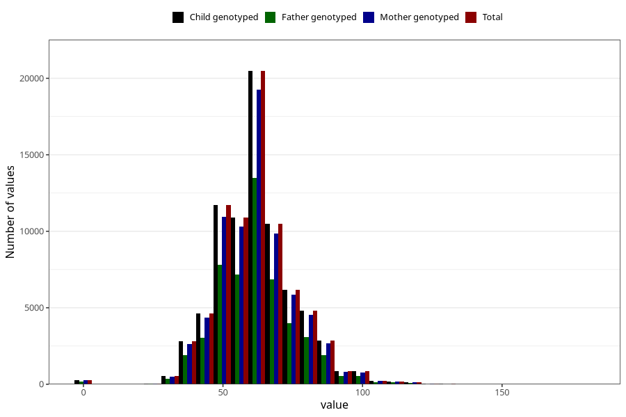

# umbilical_cord_length
Variable mapping to `NAVLESNORLENGDE` in `MFR_541_v12`.
- Number of values:

| Value | Total | Child genotyped | Mother genotyped | Father genotyped |
| ----- | ----- | --------------- | ---------------- | ---------------- |
| Missing | 2977 | 2977 | 2784 | 1993 |
| Non-missing | 78046 | 78046 | 73445 | 51318 |
| 25th percentile | 52 | 52 | 52 | 52 |
| 50th percentile | 60 | 60 | 60 | 60 |
| 75th percentile | 70 | 70 | 70 | 70 |
| Mean | 61.9564333854394 | 61.9564333854394 | 61.9839852951188 | 61.850506644842 |
| Standard deviation | 14.1112007409514 | 14.1112007409514 | 14.1065163484749 | 14.1195026500101 |
| N | 78046 | 78046 | 73445 | 51318 |

