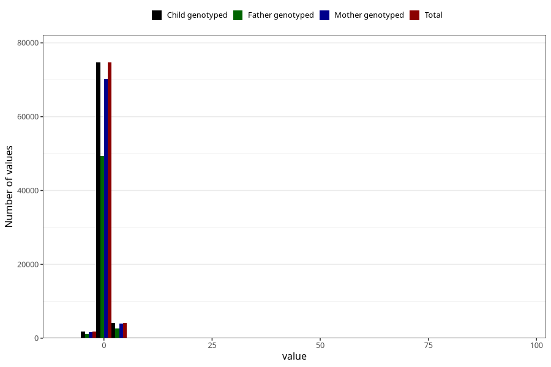

# weight_birth_z_ga
Variable mapping to `ZSCORE_BW_GA` in `MFR_541_v12`.
- Number of values:

| Value | Total | Child genotyped | Mother genotyped | Father genotyped |
| ----- | ----- | --------------- | ---------------- | ---------------- |
| Missing | 389 | 389 | 375 | 250 |
| Non-missing | 80634 | 80634 | 75854 | 53061 |
| 25th percentile | -0.54 | -0.54 | -0.54 | -0.54 |
| 50th percentile | 0.09 | 0.09 | 0.09 | 0.08 |
| 75th percentile | 0.74 | 0.74 | 0.74 | 0.74 |
| Mean | 0.128616836570181 | 0.128616836570181 | 0.128126664381575 | 0.12325040990558 |
| Standard deviation | 1.07690298570755 | 1.07690298570755 | 1.0824494410674 | 1.05932044000207 |
| N | 80634 | 80634 | 75854 | 53061 |

