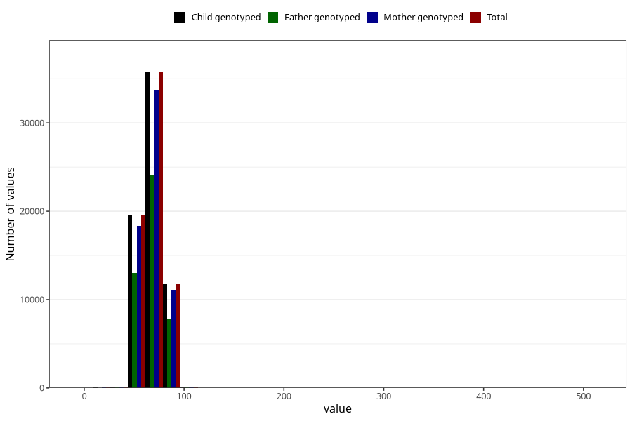

# blood_pressure_15w_diastolic
Variable mapping to `AA84` in `Skjema1_v12`.
- Number of values:

| Value | Total | Child genotyped | Mother genotyped | Father genotyped |
| ----- | ----- | --------------- | ---------------- | ---------------- |
| Missing | 13616 | 13616 | 12734 | 8222 |
| Non-missing | 67407 | 67407 | 63495 | 45089 |
| 25th percentile | 60 | 60 | 60 | 60 |
| 50th percentile | 70 | 70 | 70 | 70 |
| 75th percentile | 75 | 75 | 75 | 75 |
| Mean | 68.6972717966977 | 68.6972717966977 | 68.7060398456571 | 68.6861762292355 |
| Standard deviation | 9.38431684297338 | 9.38431684297338 | 9.37622535011941 | 9.42253138086555 |
| N | 67407 | 67407 | 63495 | 45089 |

