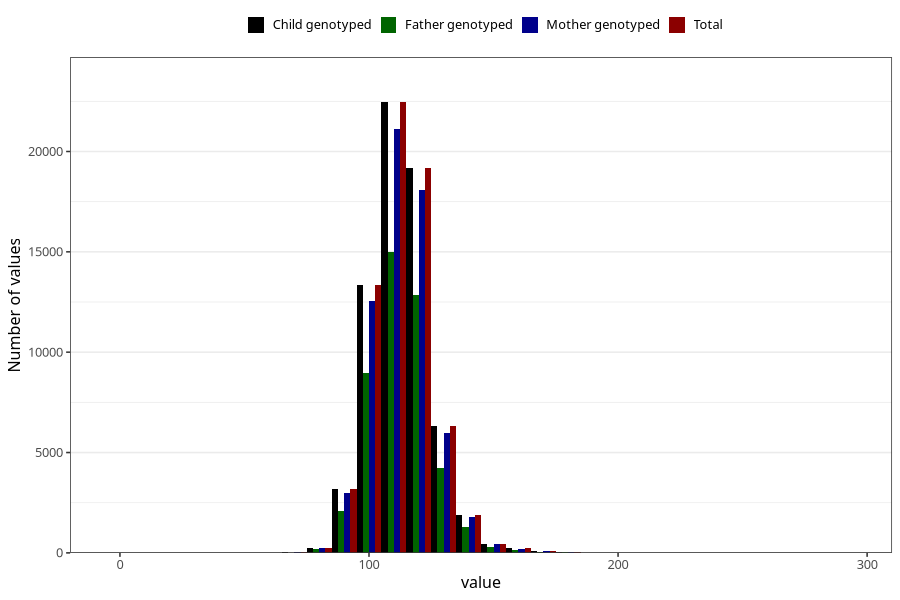

# blood_pressure_15w_systolic
Variable mapping to `AA83` in `Skjema1_v12`.
- Number of values:

| Value | Total | Child genotyped | Mother genotyped | Father genotyped |
| ----- | ----- | --------------- | ---------------- | ---------------- |
| Missing | 13554 | 13554 | 12674 | 8176 |
| Non-missing | 67469 | 67469 | 63555 | 45135 |
| 25th percentile | 105 | 105 | 106 | 106 |
| 50th percentile | 112 | 112 | 112 | 112 |
| 75th percentile | 120 | 120 | 120 | 120 |
| Mean | 114.020735448873 | 114.020735448873 | 114.051561639525 | 114.052996565858 |
| Standard deviation | 12.1776403654268 | 12.1776403654268 | 12.1684296670976 | 12.1338702299792 |
| N | 67469 | 67469 | 63555 | 45135 |

